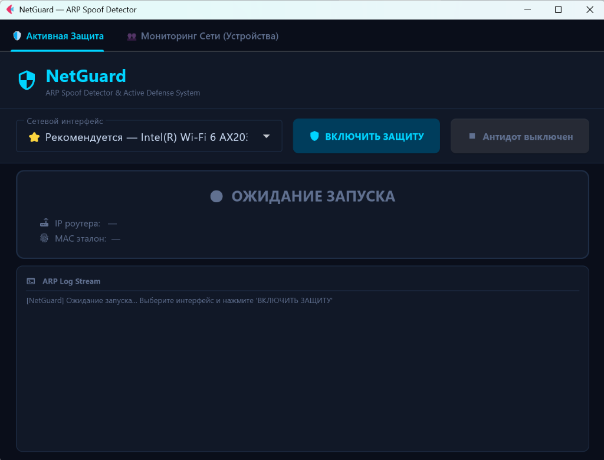
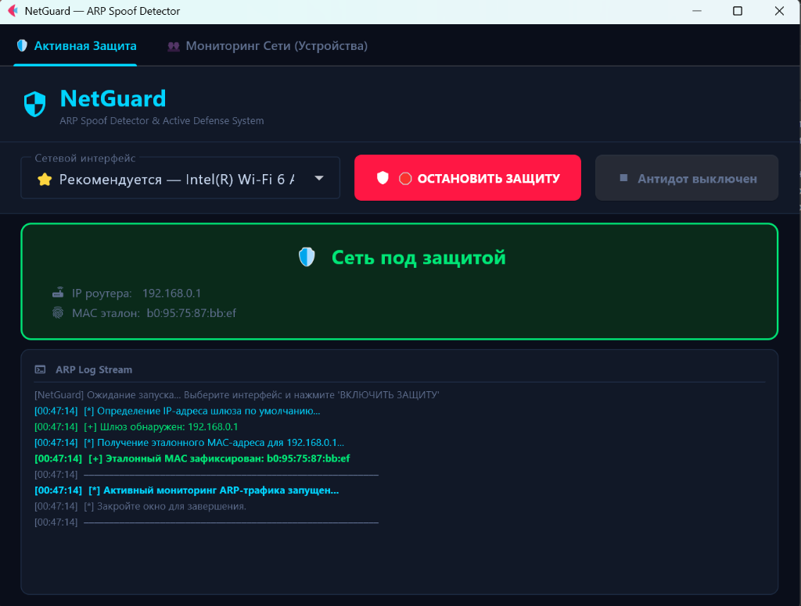
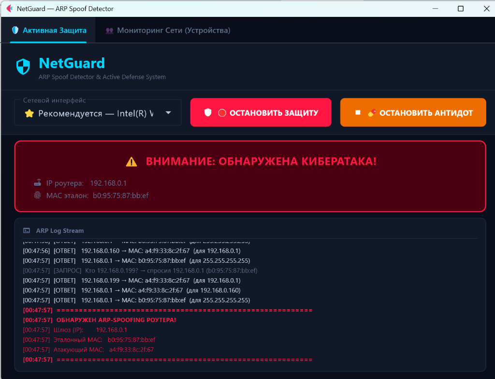
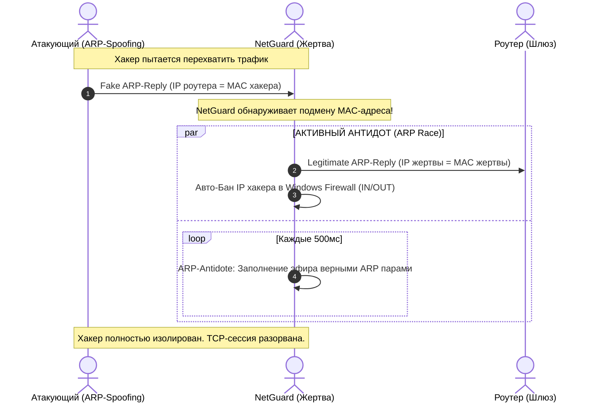

# 🛡️ NetGuard: Active Network Defense System

[](https://www.python.org/)
[](https://flet.dev/)
[](https://scapy.net/)
[](https://www.microsoft.com/windows)
[](https://opensource.org/licenses/MIT)

**NetGuard** — это комплексная система активной безопасности и обнаружения вторжений на канальном уровне (L2) для ОС Windows. В отличие от пассивных систем мониторинга, которые лишь логируют подозрительную активность, NetGuard мгновенно локализует атакующего, применяет механизм активного подавления ARP-трафика (**Антидот**) и изолирует угрозу на уровне ядра системы с помощью интеграции с Брандмауэром Windows.

---

## 📺 Демонстрация интерфейса

> [!NOTE]
> NetGuard оснащен отзывчивым графическим интерфейсом на базе **Flet** с поддержкой современной темной темы (Glassmorphism / Modern Dark) для комфортного мониторинга сетевых угроз в реальном времени.

### 1. Режим ожидания (Idle)
Начальный экран приложения. Здесь вы можете выбрать подходящий сетевой интерфейс и запустить защиту:


### 2. Активная защита (Protection Active)
Система успешно определила реквизиты шлюза по умолчанию (IP и MAC-адрес) и осуществляет непрерывный мониторинг трафика:


### 3. Обнаружение атаки и подавление (Mitigation & Alert)
Визуальная тревога при обнаружении подмены MAC-адреса шлюза. Автоматически активирован ARP-Антидот для подавления атаки в локальной сети, а также применены блокирующие правила брандмауэра для IP-адреса злоумышленника:


---

## 🚀 Ключевые функции (Features)

*   🔍 **Сниффер (Sniffer)** — Фоновый асинхронный захват и низкоуровневый разбор ARP-пакетов (запросы/ответы) на выбранном сетевом интерфейсе с использованием движка Scapy.
*   📡 **Радар (Radar)** — Непрерывное сравнение входящих пакетов с "белым" эталонным профилем шлюза (White Reference). При обнаружении поддельного MAC-адреса мгновенно вычисляются сетевые реквизиты злоумышленника.
*   💊 **Антидот (Active Defense)** — Уникальный модуль активного противодействия. При фиксации атаки запускается высокоскоростной поток генерации легитимных ARP-ответов, нейтрализующий воздействие атакующего на таблицу маршрутизации жертвы.
*   🧱 **Интеграция с Фаерволом (Firewall Integration)** — Автоматическое создание двусторонних (`IN` и `OUT`) блокирующих правил в Брандмауэре Windows через утилиту `netsh`, что полностью изолирует локальную машину от трафика атакующего.

---

## 🧠 Как работает "Антидот" (Deep Dive)

При классической атаке типа **ARP-Spoofing (Man-in-the-Middle)** атакующий отправляет ложные ARP-ответы целевому хосту (жертве), заставляя его ассоциировать IP-адрес роутера (шлюза) с MAC-адресом атакующего. В результате весь исходящий трафик жертвы начинает проходить через устройство хакера.

### Физика защиты NetGuard



1.  **ARP Race (Гонка Кэша):** После обнаружения аномалии NetGuard запускает асинхронный поток рассылки широковещательных ARP-ответов с эталонными парами `IP шлюза <-> Реальный MAC шлюза`.
2.  **Дестабилизация MITM:** Постоянная циклическая перезапись ARP-кэша на сетевом интерфейсе жертвы не позволяет атакующему сформировать стабильную сессию перехвата трафика. 
3.  **TCP Handshake Disruption:** Из-за непрерывных скачков ARP-кэша входящие и исходящие пакеты начинают уходить на разные физические интерфейсы. Это приводит к массовой потере сегментов данных, таймаутам и генерации пакетов `TCP RST` (Reset). Атака полностью рассыпается, превращаясь для атакующего в обычный обрыв связи, при этом ваши конфиденциальные данные остаются в безопасности.

---

## 🛠️ Установка и запуск

### Системные требования
*   **ОС:** Windows 10 / 11 (архитектура x64).
*   **Python:** Версия `3.10` или выше.
*   **Драйвер захвата:** Обязательно должен быть установлен драйвер **[Npcap](https://npcap.com/)** (в режиме совместимости с WinPcap) для возможности работы с сырыми (raw) сокетами.

### Инструкция по установке

1.  Клонируйте репозиторий с проектом:
    ```bash
    git clone https://github.com/yourusername/NetGuard.git
    cd NetGuard
    ```

2.  Установите необходимые библиотеки (Scapy и Flet):
    ```bash
    pip install scapy flet
    ```

3.  Запустите приложение **с правами Администратора** (это необходимо для управления правилами Брандмауэра и отправки сырых сетевых пакетов):
    *   Откройте терминал/PowerShell от имени Администратора.
    *   Выполните команду:
        ```bash
        python netguard_gui.py
        ```

---

## ⚠️ Важный дисклеймер (Important Disclaimer)

> [!WARNING]
> Данный программный продукт разработан исключительно в образовательных целях для демонстрации уязвимостей сетевых протоколов канального уровня (L2) и защиты собственных домашних или корпоративных локальных сетей.
> 
> Разработчики не несут ответственности за любой прямой или косвенный ущерб, вызванный некорректным использованием данного программного обеспечения. Использование утилит для сетевого анализа в чужих сетях без предварительного письменного согласия их владельца может быть квалифицировано как правонарушение.

---

## 📄 Лицензия

Проект распространяется под лицензией **MIT**. Подробнее см. файл `LICENSE`.
